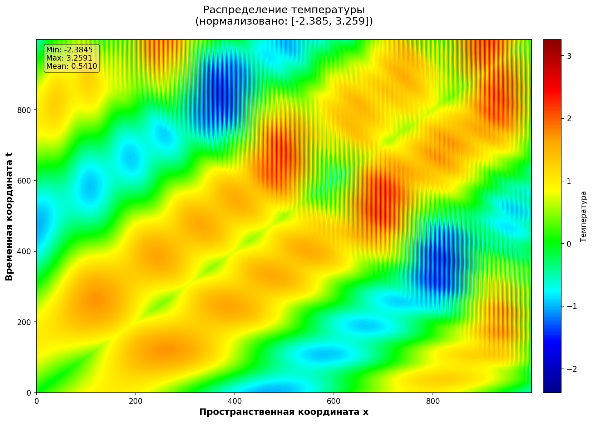
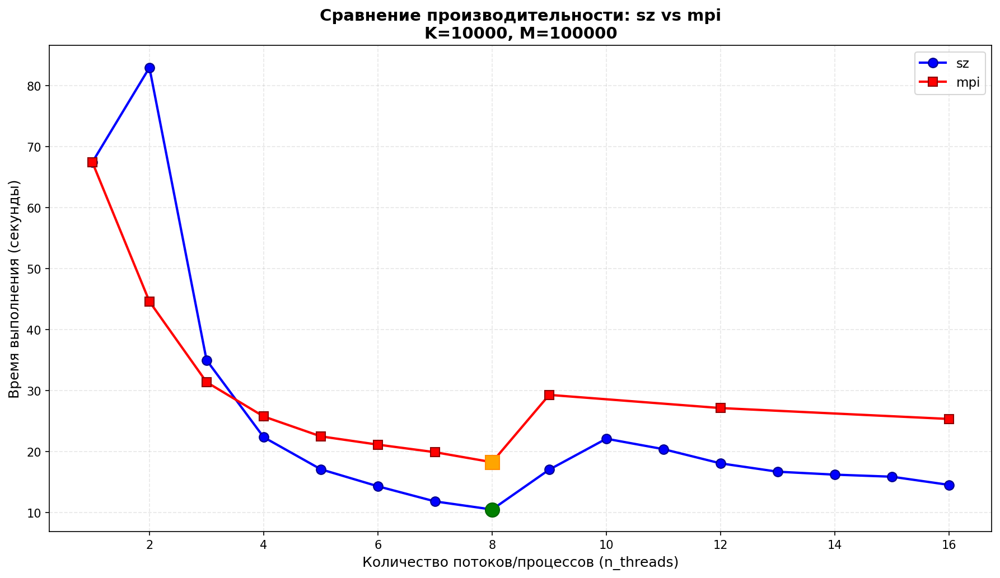
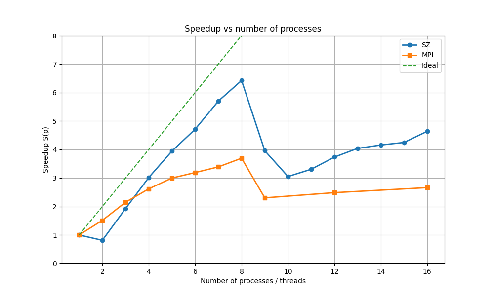
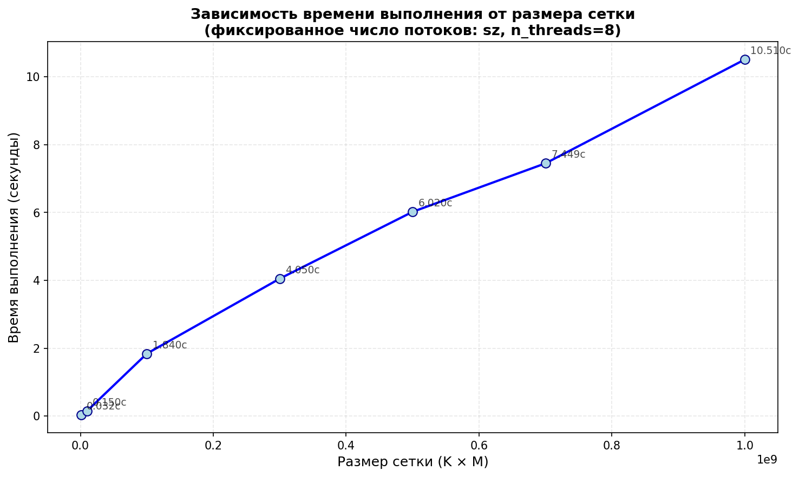

## Лабораторные работы по параллельному программированию

### Вычисление экспоненты через ряд Тейлора
Данные значения экспоненты для проверки до 1 000 000 знака после запятой взяты с сайта https://www.gutenberg.org/ebooks/127

Также можно взять с сайта https://www.numberworld.org/digits/E/

### Уравнение переноса
[./transfer/transfer_eq_cons.c](./transfer/transfer_eq_cons.c) - реализация последоватльного алгоритма решения уравнения переноса на равномерной сетке [$x = m h$, $t = k \tau$] в координатах [x, t]

[./transfer/transfer_eq_mpi.c](./transfer/transfer_eq_mpi.c) - параллельная оптимизация, но не самая эффективная

[./transfer/transfer_eq_mpi_sz.c](./transfer/transfer_eq_mpi_sz.c) - наиболее эффективная реализация, где один из потоков не участвует в вычислениях, но собирает данные с остальных

Результаты вычислений:

Результаты тестов: 

| Реализация | $n_{threads}$ | K | M | $t_{exec}$ |
|----|----|----|---|---|
| sz | 8 | 1000 | 1000 | 0.032 |
| sz | 8 | 1000 | 10000 | 0.15 |
| sz | 8 | 10000 | 10000 | 1.84 |
| sz | 8 | 10000 | 30000 | 4.05 |
| sz | 8 | 10000 | 50000 | 6.02 |
| sz | 8 | 10000 | 70000 | 7.449 |
| sz | 8 | 10000 | 100000 | 10.51 |
| | | | |
| con | 1 | 10000 | 100000 | 67.47 |
| sz | 2 | 10000 | 100000 | 82.99 |
| sz | 3 | 10000 | 100000 | 35.01 |
| sz | 4 | 10000 | 100000 | 22.37 |
| sz | 5 | 10000 | 100000 | 17.11 |
| sz | 6 | 10000 | 100000 | 14.32 |
| sz | 7 | 10000 | 100000 | 11.84 |
| sz | 8 | 10000 | 100000 | 10.51 |
| sz | 9 | 10000 | 100000 | 17.05 |
| sz | 10 | 10000 | 100000 | 22.12 |
| sz | 11 | 10000 | 100000 | 20.41 |
| sz | 12 | 10000 | 100000 | 18.08 |
| sz | 13 | 10000 | 100000 | 16.71 |
| sz | 14 | 10000 | 100000 | 16.23 |
| sz | 15 | 10000 | 100000 | 15.89 |
| sz | 16 | 10000 | 100000 | 14.55 |
| | | | |
| con | 1 | 10000 | 100000 | 67.47 |
| mpi | 2 | 10000 | 100000 | 44.62 |
| mpi | 3 | 10000 | 100000 | 31.40 |
| mpi | 4 | 10000 | 100000 | 25.77 |
| mpi | 5 | 10000 | 100000 | 22.51 |
| mpi | 6 | 10000 | 100000 | 21.15 |
| mpi | 7 | 10000 | 100000 | 19.91 |
| mpi | 8 | 10000 | 100000 | 18.27 |
| mpi | 9 | 10000 | 100000 | 29.3 |
| mpi | 12 | 10000 | 100000 | 27.15 |
| mpi | 16 | 10000 | 100000 | 25.36 |

