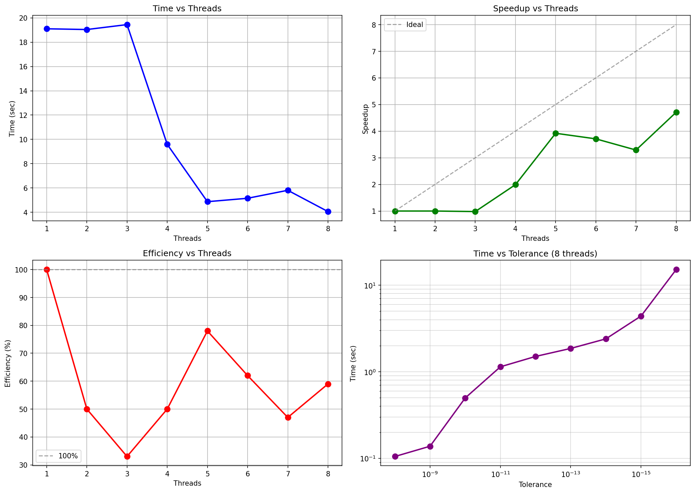

### Результаты

**Tolerance:** 1e-14

| Threads | Avg Time (sec) | Speedup | Efficiency | Result |
|---------|---------------|---------|------------|--------|
| 1 | 19.101 | 1.00 | 100% | 0.504066497877486 |
| 2 | 19.040 | 1.00 | 50% | 0.504066497877486 |
| 3 | 19.445 | 0.98 | 33% | 0.504066497877486 |
| 4 | 9.592 | 1.99 | 50% | 0.504066497877486 |
| 5 | 4.873 | 3.92 | 78% | 0.504066497877486 |
| 6 | 5.154 | 3.71 | 62% | 0.504066497877486 |
| 7 | 5.810 | 3.29 | 47% | 0.504066497877486 |
| 8 | 4.060 | 4.71 | 59% | 0.504066497877486 |

**Замер времени от точности:**

| Threads | Tolerance | Result | Time (sec) |
|---------|-----------|--------|------------|
| 8 | 1e-8 | 0.504066496768098 | 0.105 |
| 8 | 1e-9 | 0.504066497782294 | 0.138 |
| 8 | 1e-10 | 0.504066497860109 | 0.498 |
| 8 | 1e-11 | 0.504066497875269 | 1.141 |
| 8 | 1e-12 | 0.504066497877331 | 1.503 |
| 8 | 1e-13 | 0.504066497877474 | 1.860 |
| 8 | 1e-14 | 0.504066497877486 | 2.399 |
| 8 | 1e-15 | 0.504066497877487 | 4.402 |
| 8 | 1e-16 | 0.504066497877487 | 15.162 |

